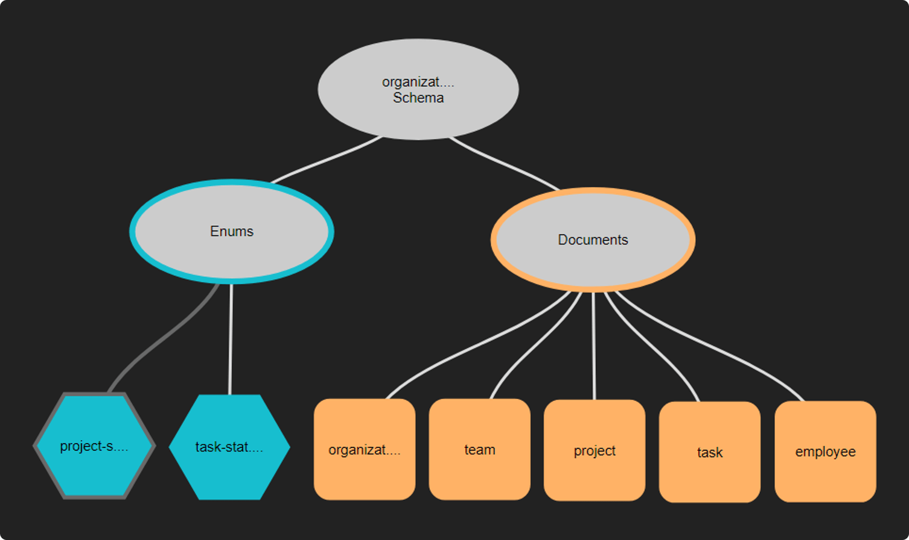

# Model Data

## Visual data modeling using the dashboard

Use the **Data Product Model** view in [TerminusCMS](https://dashboard.terminusdb.com) or the local TerminusDB dashboard ([including in bootstrap install](../../terminusdb/install/install-as-docker-container.md)) to visually build simple or complex data models. The diagrams further below illustrate two possible implementations of the organization model introduced in the previous section. In addition to visually building models, the dashboard enables:

* Flexible relationships between elements such as documents and sub-documents, and classes and sub-classes.
* Enumeration objects related to document elements.
* A comprehensive set of properties (XSD data types) for elements.
* JSON views of product models and properties.

### A simple document model

This example uses a simple project management application that has a data structure like:


The diagram below illustrates an implementation of the organization model using a simple document structure. The enumeration objects hold status values applicable to projects and tasks.

#### Diagram: The organization model using documents



### A class-based document model

The diagram below illustrates a more intuitive implementation of the organization model using documents and sub-documents, or classes or sub-classes. This approach enables sub-documents to inherit the properties of the parent document - similar to inheritance in Object-Oriented Programming.&#x20;

#### Diagram: The organization model using classes and sub-classes



A short video showing how to use the dashboard to build your schema and model data


## Data modeling using JSON

TerminusDB supports the creation of data models using JavaScript Object Notation (JSON.) TerminusDB also generates JSON for models created visually using the dashboard.

### Class hierarchies

JSON supports the definition of classes and subclasses. Classes define **types** of complex data structures. Sub-classes inherit all parent data type definitions. Examples below.

**Class**

```javascript
"@type": "Class",
"@id": "organization",
```

**Subclass**

```javascript
"@type": "Class",
"@id": "team",
"@inherits": "organization",
```

**Properties for team**

```javascript
"name": "xsd:string",
"desc": "xsd:string",
"cost_code": "xsd:integer",
"location": "xdd:coordinate",
"setup_dt": "xsd:dateTime"
```

**JSON for the organization model**

```javascript
[
  {
    "@base": "terminusdb:///data/",
    "@schema": "terminusdb:///schema#",
    "@type": "@context"
  },
  {
    "@id": "project-status",
    "@type": "Enum",
    "@value": [
      "in-progress",
      "on-hold",
      "completed"
    ]
  },
  {
    "@id": "project",
    "@inherits": "organization",
    "@key": {
      "@type": "Random"
    },
    "@type": "Class"
  },
  {
    "@id": "organization",
    "@key": {
      "@type": "Random"
    },
    "@type": "Class"
  },
  {
    "@id": "team",
    "@inherits": "organization",
    "@key": {
      "@type": "Random"
    },
    "@type": "Class"
  },
  {
    "@id": "task",
    "@inherits": "project",
    "@key": {
      "@type": "Random"
    },
    "@type": "Class"
  },
  {
    "@id": "task-status",
    "@type": "Enum",
    "@value": [
      "in-progress",
      "on-hold",
      "completed"
    ]
  },
  {
    "@id": "employee",
    "@inherits": "team",
    "@key": {
      "@type": "Random"
    },
    "@type": "Class"
  }
]
```

## Further Reading

#### Come from a relational database background?

[Have a read of the Relational vs Graph explanation](../../explanations/relational-vs-graph-databases/)
